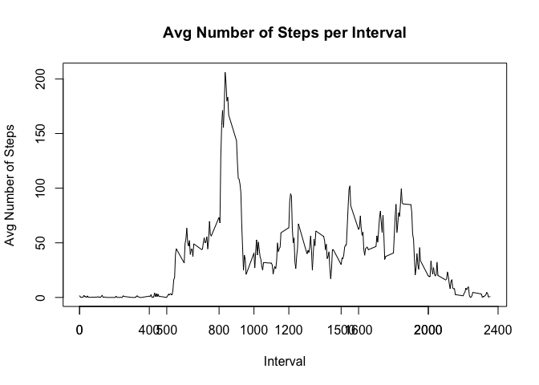
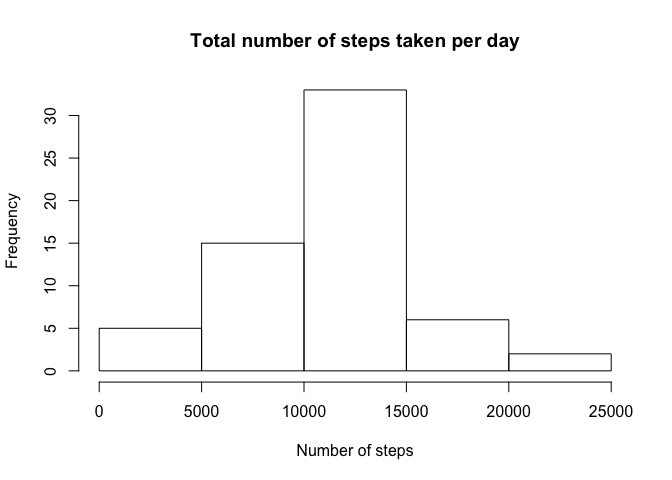
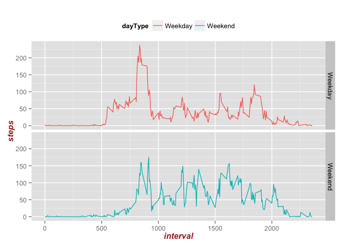

# Reproducible Research: Peer Assessment 1


## Loading and preprocessing the data

```r
##Load needed libraries
library(ggplot2)
library(plyr)
library(timeDate)

##read data from csv file
activityData <- read.csv("activity.csv", colClasses = "character", sep = ",")
##pre-processess data 
activityData$steps<-as.numeric(activityData$steps)
activityData$date<-as.Date(activityData$date)
activityData$interval<-as.numeric(activityData$interval)
```


## What is mean total number of steps taken per day?

### Histogram of total number of steps taken per day

```r
aggData <- aggregate(steps ~ date, data = activityData, FUN=sum, na.rm=TRUE)
hist(as.numeric(aggData$steps),
     xlab="Number of steps" ,  
     main = "Total number of steps taken per day"
)
```

 

### Calculate and report the mean and median total number of steps taken per day

```r
print(mean(as.numeric(aggData$steps)))
```

```
## [1] 10766.19
```

```r
print(median(as.numeric(aggData$steps)))
```

```
## [1] 10765
```


## What is the average daily activity pattern?
### Time series plot of 5-minute interval and avg-number of steps taken , averaged across all days

```r
intervalData <- aggregate(steps ~ interval, data = activityData, FUN=mean, na.action  = na.pass, na.rm=TRUE)
plot( intervalData$interval, intervalData$steps, 
      xlab="Interval" , 
      ylab="Avg Number of Steps" , 
      main = "Avg Number of Steps per Interval",
      type = "l",
     
)

axis(side = 1,  at = seq(0,2400, by =200), labels = T)
```

 

### Which 5-minute interval, on average across all the days in the dataset, contains the maximum number of steps?

```r
print(intervalData$interval[which.max(intervalData$steps)])
```

```
## [1] 835
```

## Imputing missing values
### Report the total number of missing values in the dataset

```r
print(sum(is.na(activityData$steps)))
```

```
## [1] 2304
```
### Create a new dataset that is equal to the original dataset but with the missing data filled in.

```r
activityData$dayOfWeek <- weekdays(activityData$date)
meanStepsByIntervalDayOfWeek <- ddply(activityData, c('interval', 'dayOfWeek'),
                                      summarise, avgSteps = mean(steps, na.rm=TRUE))
activityData <- merge(activityData, meanStepsByIntervalDayOfWeek, 
      by = c("interval", "dayOfWeek") 
)
activityData$steps  <- with(activityData, ifelse(is.na(activityData$steps), activityData$avgSteps, activityData$steps))
aggDataNew <- aggregate(steps ~ date, data = activityData, FUN=sum)
```
### Histogram of the total number of steps taken each day

```r
##par(mar=c(2,2,2,2))
hist(as.numeric(aggDataNew$steps),
     xlab="Number of steps" ,  
     main = "Total number of steps taken per day")
```

 


### Calculate and report the mean and median total number of steps taken per day


```r
print(mean(aggDataNew$steps))
```

```
## [1] 10821.21
```

```r
print(median(aggDataNew$steps))
```

```
## [1] 11015
```
## Are there differences in activity patterns between weekdays and weekends?

```r
activityData$dayType<- isWeekday(activityData$date, wday = 1:5)
activityData$dayType[activityData$dayType == "TRUE"] <- "Weekday"
activityData$dayType[activityData$dayType == "FALSE"] <- "Weekend"

typeData <- aggregate(steps ~ interval+dayType, data = activityData, FUN=mean, na.action  = na.pass, na.rm=TRUE)
```

### Panel plot containing a time series plotof the 5-minute intervaland the average number of steps taken, averaged across all weekday days or weekend days 

```r
t<-ggplot(typeData,aes(interval,steps), type="l") + geom_line(aes(color=dayType))+ facet_grid(dayType~.,)
t+theme(axis.title=element_text(face="bold.italic", 
                                size="12", color="brown"), legend.position="top")
```

 
